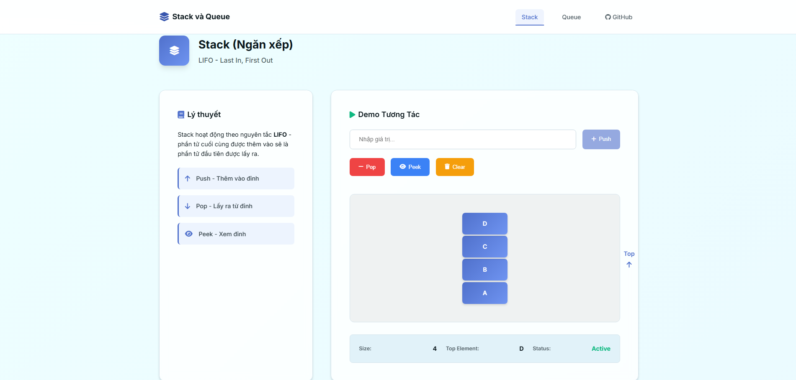

# 📚 Stack & Queue Interactive Visualization

> Interactive learning tool for understanding Stack and Queue data structures through visual demonstrations and real-world applications.

## 🌟 Features

### Stack (LIFO - Last In, First Out)
- **Interactive Push/Pop Operations** - Add and remove elements with smooth animations
- **Real-time State Tracking** - Monitor stack size, top element, and status
- **Visual Feedback** - Clear visual representation of LIFO behavior
- **Practical Applications** - Examples from real-world scenarios

### Queue (FIFO - First In, First Out)
- **Interactive Enqueue/Dequeue Operations** - Add and remove elements with visual flow
- **Front/Rear Tracking** - Monitor both ends of the queue
- **Animation System** - Smooth transitions showing element movement
- **Real-world Examples** - Understanding through practical applications

## 🚀 Live Demo

**[👉 Try the Demo Here](https://stackqueue.lequanganh.id.vn/)**



## 🛠️ Technologies Used

- **HTML5** - Semantic structure and accessibility
- **CSS3** - Modern styling with animations and responsive design
- **Vanilla JavaScript** - Clean, performant interactive functionality
- **Font Awesome** - Professional icons and visual elements
- **Google Fonts** - Typography optimization

## 📖 What You'll Learn

### Stack Applications
- 🔄 **Undo/Redo Functionality** - Text editors, image editing
- 🌐 **Browser History** - Back button implementation
- 🎯 **Function Call Stack** - Programming execution flow
- 🧩 **Backtracking Algorithms** - Maze solving, puzzle games

### Queue Applications
- 🖨️ **Print Queue Systems** - Document processing order
- ⚡ **Task Scheduling** - Operating system job management
- 🔍 **BFS Algorithm** - Graph traversal and shortest path
- 📺 **Data Streaming** - Video/audio buffer management

## 🏗️ Project Structure

```
stack-queue-visualizer/
├── index.html              # Main HTML structure
├── styles/
│   ├── main.css            # Core styling
│   ├── animations.css      # Animation definitions
│   └── responsive.css      # Mobile responsiveness
├── js/
│   ├── classes/
│   │   ├── Stack.js        # Stack data structure implementation
│   │   └── Queue.js        # Queue data structure implementation
│   ├── components/
│   │   ├── StackDemo.js    # Stack visualization logic
│   │   └── QueueDemo.js    # Queue visualization logic
│   ├── utils/
│   │   ├── animations.js   # Animation utilities
│   │   └── notifications.js # Toast notification system
│   └── main.js             # Application initialization
├── assets/
│   └── favicon.ico         # Site favicon
└── README.md
```

## 🎯 Key Features Implementation

### Interactive Controls
```javascript
// Stack Operations
push(element)    // Add element to top
pop()           // Remove and return top element
peek()          // View top element without removing
clear()         // Remove all elements

// Queue Operations  
enqueue(element) // Add element to rear
dequeue()       // Remove and return front element
front()         // View front element
clear()         // Remove all elements
```

### Visual Animations
- **Smooth Transitions** - CSS animations for element movement
- **State Indicators** - Real-time status updates
- **Responsive Design** - Works on desktop, tablet, and mobile
- **Toast Notifications** - User feedback for all operations

## 🚀 Getting Started

### Prerequisites
- Modern web browser (Chrome, Firefox, Safari, Edge)
- No additional dependencies required

### Installation

1. **Clone the repository**
```bash
git clone https://github.com/QuangAnh253/stack-queue.git
cd stack-queue-visualizer
```

2. **Open in browser**
```bash
# Simply open index.html in your browser
open index.html
# or
python -m http.server 8000  # For local server
```

3. **Start Learning!**
   - Navigate to Stack or Queue sections
   - Input values and try different operations
   - Observe the visual feedback and animations

## 💡 Usage Examples

### Stack Example
```javascript
// Push elements
stack.push("HTML");
stack.push("CSS");
stack.push("JavaScript");

// Pop elements (LIFO order)
console.log(stack.pop()); // "JavaScript"
console.log(stack.pop()); // "CSS"
console.log(stack.pop()); // "HTML"
```

### Queue Example
```javascript
// Enqueue elements
queue.enqueue("Customer 1");
queue.enqueue("Customer 2");
queue.enqueue("Customer 3");

// Dequeue elements (FIFO order)
console.log(queue.dequeue()); // "Customer 1"
console.log(queue.dequeue()); // "Customer 2"
console.log(queue.dequeue()); // "Customer 3"
```

## 📱 Responsive Design

- **Desktop**: Full feature experience with detailed animations
- **Tablet**: Optimized touch interactions and layout
- **Mobile**: Simplified interface maintaining core functionality

## 🎨 Customization

### Styling
Modify `styles/main.css` to change:
- Color scheme and themes
- Animation timing and effects
- Layout and spacing

### Functionality
Extend `js/classes/` to add:
- Additional data structure operations
- Custom validation rules
- Enhanced animations


### Ideas for Contribution
- [ ] Add more data structures (Linked List, Binary Tree)
- [ ] Implement algorithm visualizations (Sorting, Searching)
- [ ] Add code examples in multiple languages
- [ ] Improve accessibility features
- [ ] Add unit tests


## 👨‍💻 Author

**[Lê Quang Anh]** - *Information system Student at UTT*

- 🌐 **Website**: [Quang Anh's Portfolio](https://lequanganh.id.vn)
- 📧 **Email**: lequanganh253@gmail.com
- 💼 **LinkedIn**: [linkedin.com/in/yourprofile](https://www.linkedin.com/in/leequanh/)
- 🐱 **GitHub**: [@QuangAnh253](https://github.com/QuangAnh253/)
